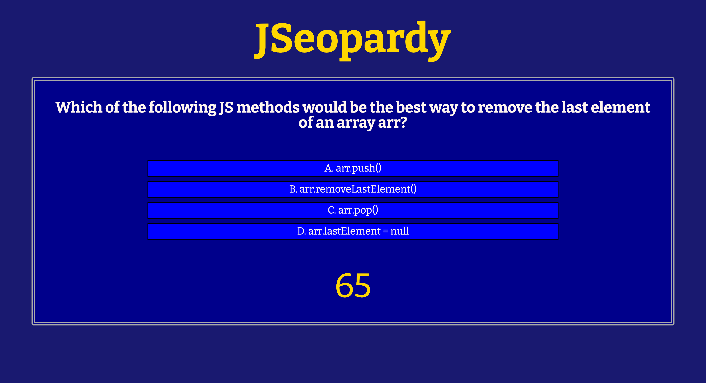

# jSeopardy

## Description 
The goal of this project was to create a quiz applet to test your coding knowledge. The user is to be presented with a start page,
and when they hit the start button, a series of questions was to be presented to them. The user will also have to answer the questions
under time pressure, so a clock was to be implemented into the app. After answering the questions, the user also has the opportunity to 
save their accomplishment in local storage.


## Link and Preview of the site

[Click to view the live application](https://sharkby7e.github.io/JSeopardy/)



## Technologies Employed

| Techlogy   | Implementation/Use          |
|:----------:|-----------------------------|
|HTML        | Structure of Webpage        |
|CSS         | Styling of Application      |
|JavaScript  | Dynamically updating the DOM|

## Key Functions

### countDown 

This was the function that maintained the clock to time the user through their questions. This also provided the
score to the user in the end. The time went down by 10 every time the user answered a question incorrectly.
```javascript
function countdown() {
  clock.textContent = timeLeft
    var timeInterval = setInterval(function() {
    if(question.textContent == ""){
      clearInterval(timeInterval)
    }
    if (timeLeft > 0) {
      timeLeft--;
      clock.textContent = timeLeft
    } else {
      clearInterval(timeInterval)
      showEndScreen()
    }
  }, 1000)
}
```

### populateGameBoard

This was the main function that wrote the questions to the screen.  It reads through an array of objects that 
I defined. The objects were all questions that had 3 properties, the question text, an array of answer choices, 
and the correct answer choice.
Whichever of the answer choices matched the character with the correct choice, was given a data attribute, which when 
clicked, would notify the user that they were correct, and would not deduct from their score.

```javascript
function populateGameBoard() {
  while(answers.firstChild){
    answers.removeChild(answers.firstChild)
  }
  var quest = questions.shift()
  if (questions.length==0){
    showEndScreen()
  }
  question.textContent= quest.question
  var ans = quest.answers
  ans.forEach(function(element){
    var li = document.createElement("li") 
    if(quest.correct === element.charAt(0)){
      li.setAttribute("data-correct", "true")
    }
    li.textContent = element
    answers.appendChild(li)
  })
}
```
## Summary and Learning Points
This greenfield project was a great opportunity to pay homage to one of my favorite gameshows. I learned how to
use JavaScript to dynamically update the DOM, which allowed me to have different "pages", revealed to the user. 
I also employed eventListeners and the timeInterval, both of which were interesting ways to make pages more dynamic
and interesting to the user. 
